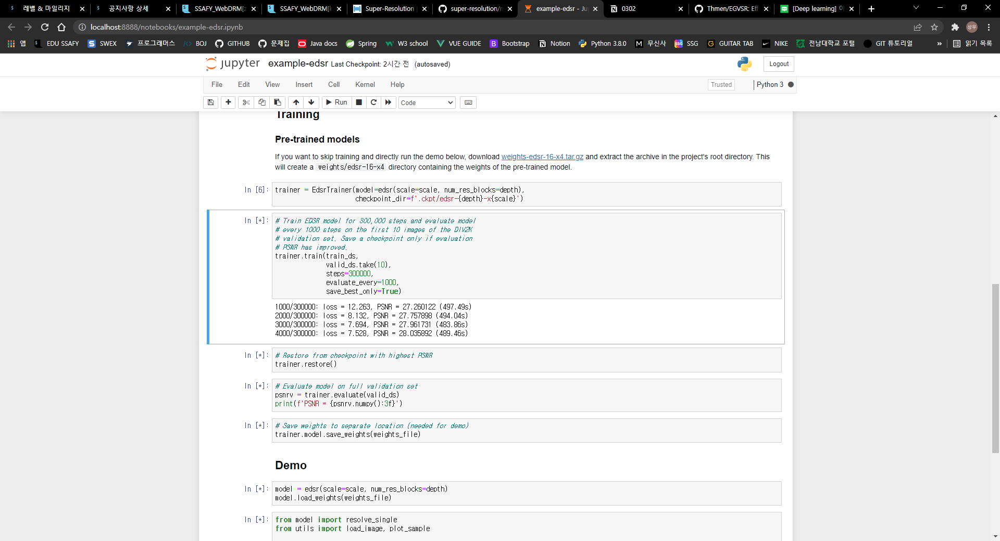

# 0302

- [Real-Time Video SR](https://github.com/Thmen/EGVSR) 데이터 세트를 구하는데 문제 발생(일단 보류)
- \***\*[Single Image Super-Resolution with EDSR, WDSR and SRGAN](https://github.com/krasserm/super-resolution)\*\***
- 해당 Github의 Instruction을 따라 EDSR 훈련 진행, 1000 Steps / 497.49s (15:00 ~)
- 시간이 상당히 소요되므로 사전 훈련 모델 사용

- 구글 오픈 이미지를 사용하기 위해 python fiftyone이라는 라이브러리를 활용
- [fiftyone example](https://voxel51.com/docs/fiftyone/tutorials/open_images.html)
- 앞으로 해야 할 일
  - 실시간으로 필터를 적용할 수 있는 가벼운 SR 모델 찾기
  - 구글 오픈 이미지를 이용하여 이미지 준비하기
  - 이미지를 ffmpeg을 사용하여 VGA 포맷으로 맞춰 LR 이미지 준비 및 일반필터를 사용하여 HD 포맷으로 업스케일 된 이미지 준비하기
  - SR을 적용하여 일반필터 이미지와 VMAF 스코어 비교하기
